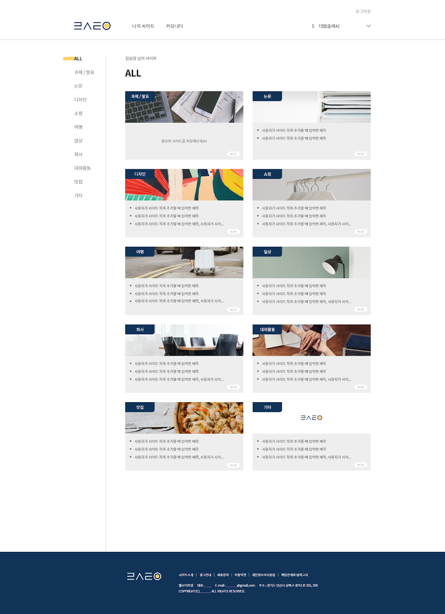
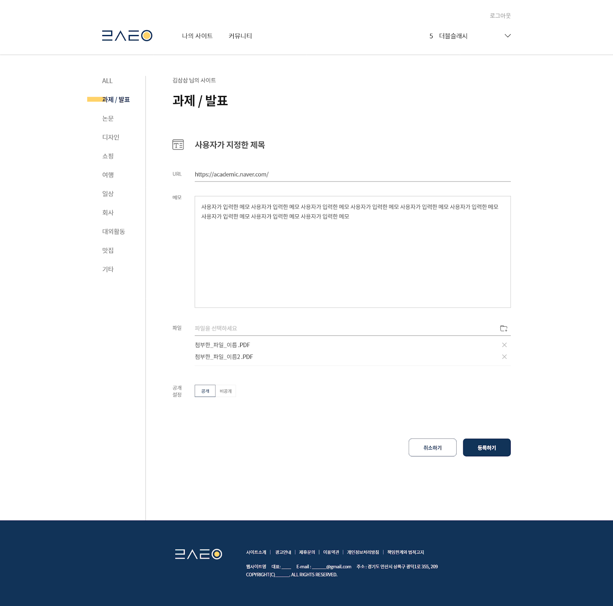

# 5th-mini-team3-web

<strong>첫 연합동아리</strong>
  

처음으로 연합동아리에 들어가서 백엔드 개발에 참여했었다.  
사전에 간단하게 친구와 함께 진행한 <a href = "https://github.com/jjmmll0727/mini-covid119">토이프로젝트</a> 덕분에 심플하게 restful api에 대해서 알고 시작했다.  
그 덕에 프로젝트를 시작할 수 있었다고 생각한다.  

 

##### 기획의도
<strong>나는 작업을 할때 이런 사이트들을 이용하는데 다른 사람들은 어떤 사이트를 이용할까?</strong>  
회원 별로 저장하고 싶은 사이트들을 저장하고 다른 회원들과 공유하는 일종의 커뮤니티를 형성 
<code>mongodb</code>로 데이터를 관리하고, <code>jwt token</code>으로 로그인 및 페이지 접근성을 관리함. 

### stack
> frontend
>> react
>> next
>> redux

> backend
>> nodejs
>> express
>> mongodb

> database
>> mongodb
>> aws s3

> devops
>> aws ec2

### 구현화면

